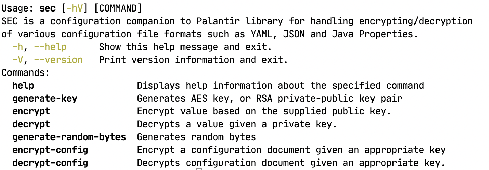

# SEC - Security companion to the excellent Palantar library

_SEC_ offers an companion to the use with the  [Palantar Configuration Values](https://github.com/palantir/encrypted-config-value) is an open source library which provides an easy way to secure configuration for Java server side applications written in DropWizard.

The Palantar's library is excellent to use, but lacks an eloquent command line tool to work with encrypted configurations. SEC attempts to fill this gap by providing, in addition to core encrypting encrypting of single value, the following additional capabilities:

- Ability to also decrypt not also a single value, but also a complete document.
- Ability to encrypt a values within a configuration document based on ant style property path selections.
- Optionally convert an encrypted/decrypted configuration document to JSON, and Java Properties.
-  Generate secure random binary values with, or without seed values.

On a pure non functional manner, the tool also attempts to make it an easy command line application to use by:

- Extensive error messages with hints to fix incorrect usages.
- Attempts to use a consistent command line arguments/options use throughout.

As most command line utilities are cryptic at best (even with documentation), _SEC_ also attempts to provide a better user experience by supplying descriptive/detail error messages. 

## Installing

1. Download the latest binary distribution.
2. Unzip/uncompress the application to folder of our choice.
3. Add the bin folder to your path.

> You can now run the tool by typing `sec` in  the command line.

## Running 

Client Requirements:

1. Java 8 or above runtime.

Open a command prompt, and type in `sec help`, you should see the following: 



Note the following: 

If you want see help on specific command you may type in `sec help encrypt-config`, for example, the above request will produce detailed help on what to pass to the command:


## Build it yourself

1. Clone the source project using GIT.

2. Checkout the version you want to build.

3. Open up an terminal where you checked out the project.

4. Type in the following command:
   
   ```shell
   ./gradlew assembleDist
   ```
   
   This will produce a `.tar` and `.zip` distribution in the following locations:
   
   ```shell
   app/build/install
   ```


